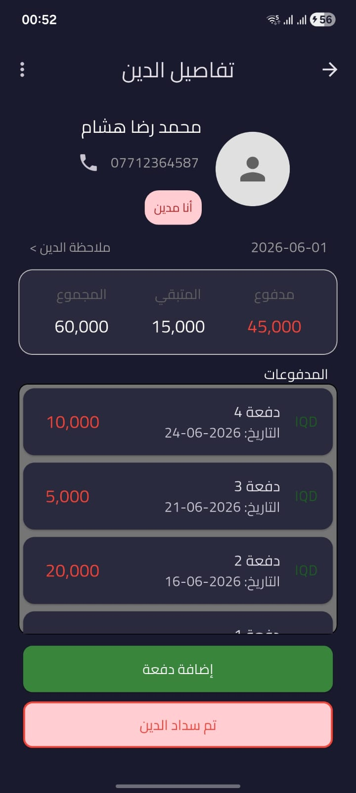
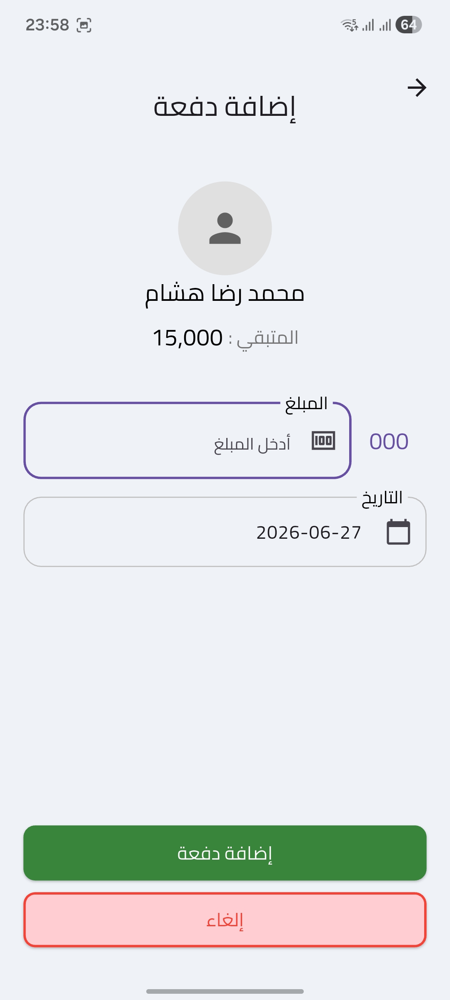
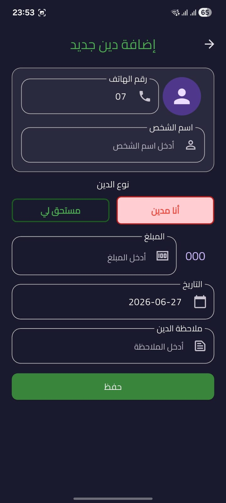
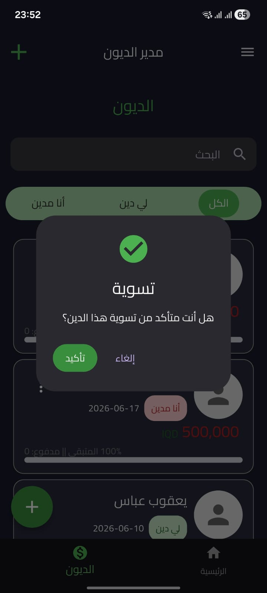
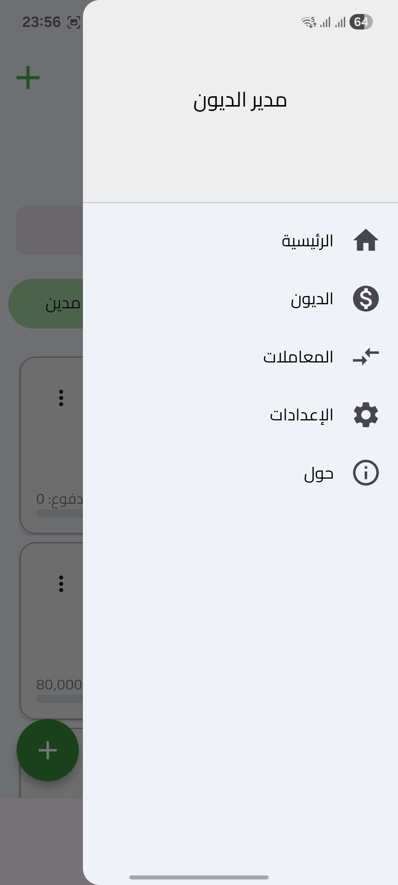
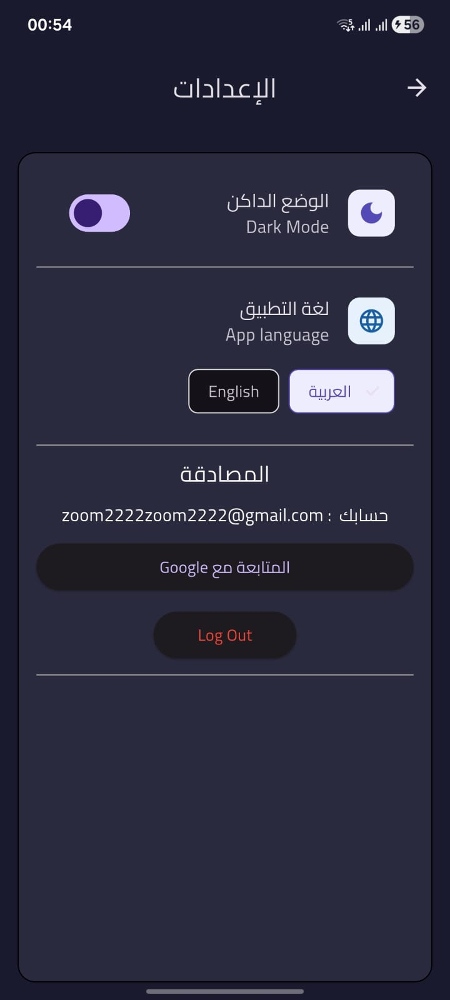
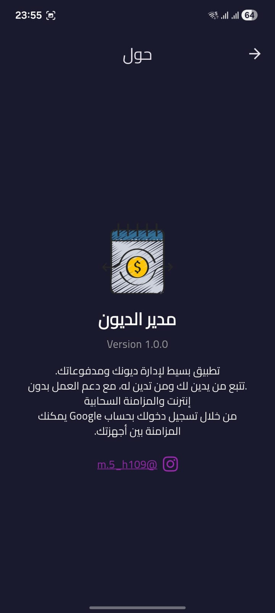

# 💰 Debts Manager

A mobile application to manage debts and payments between people, built with Flutter and ASP.NET Core.

---

## 📱 Screenshots

   
   
   

> Replace with your actual screenshot filenames.

---

## ✨ Features

- 📴 **Offline-First** – Works without internet connection
- 🔄 **Auto Sync** – Syncs data every 60 seconds automatically
- 🔐 **Google Sign-In** – Login with your Google account
- 👥 **People Management** – Add and manage people you owe or are owed by
- 💸 **Debts & Payments** – Track debts and payments easily
- 🌙 **Dark / Light Theme** – Switch between themes
- 🌍 **Arabic & English** – Full localization support

---

## 🛠️ Tech Stack

| Layer | Technology |
|-------|-----------|
| Mobile | Flutter / Dart |
| State Management | Provider |
| Local Database | SQLite (sqflite) |
| Backend | ASP.NET Core Web API |
| Database | SQL Server |
| Auth | Google Sign-In |

---

## 👨‍💻 Developer

**Mohammed Reda** – Flutter & ASP.NET Developer

## ⚠️ Note

The API URL is private and not included in this repository.
